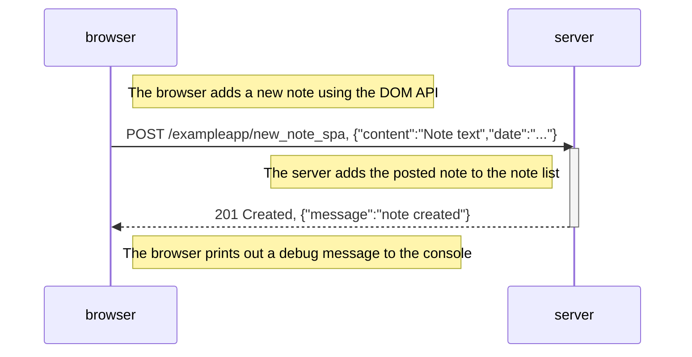

```mermaid
sequenceDiagram
    participant browser
    participant server

    Note right of browser: The browser adds a new note using the DOM API
    browser->>server: POST /exampleapp/new_note_spa, {"content":"Note text","date":"..."}
    activate server
    Note left of server: The server adds the posted note to the note list
    server-->>browser: 201 Created,  {"message":"note created"}
    deactivate server

   
    Note right of browser: The browser prints out a debug message to the console
```